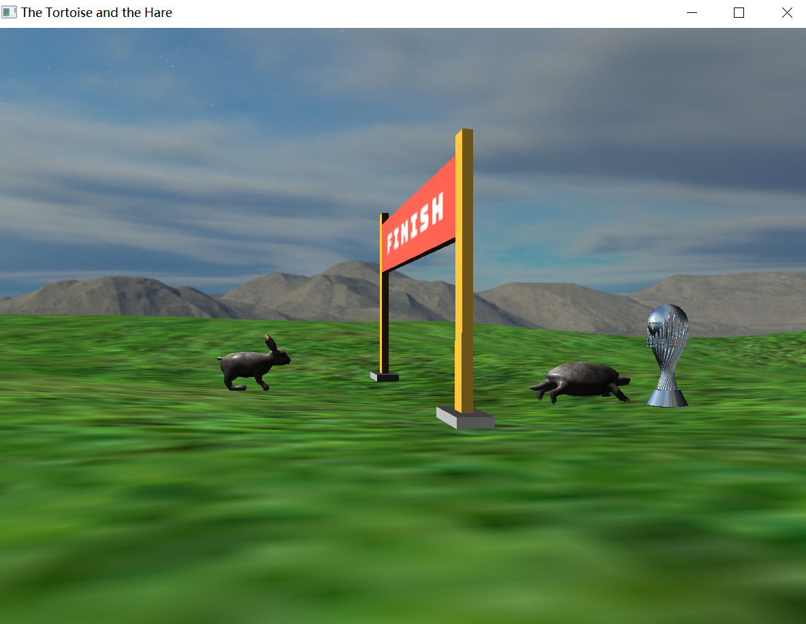
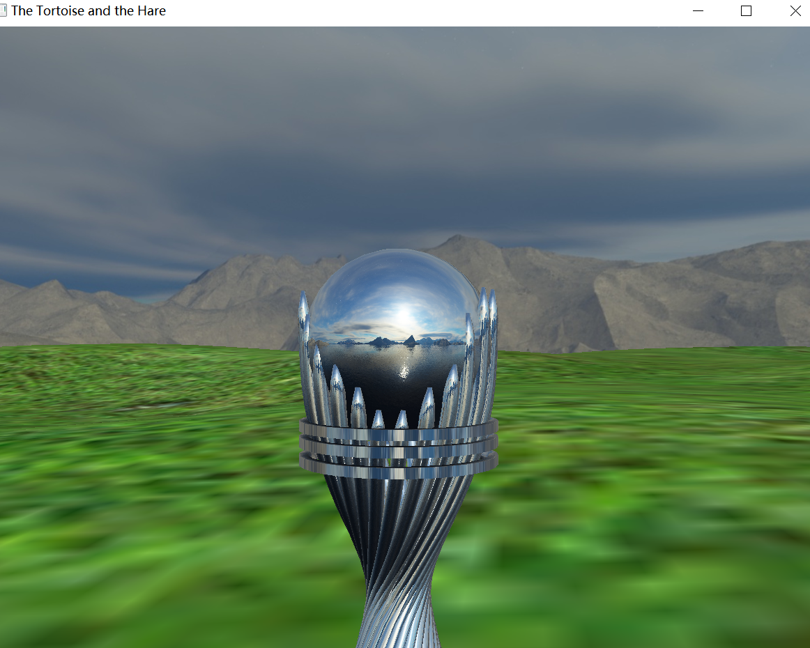

# OpenGL-animation 龟兔赛跑动画
OpenGL-animation 文件结构

├─openGLEnvir //项目环境

│  ├─Include // 头文件

│  └─Labs //静态数据连接库

└─openGL_project

​    ├─learnopengl

​    ├─resources //模型资料（[来源cgtrader](https://www.cgtrader.com/)）

​    │  ├─gate

​    │  ├─grass

​    │  ├─rabbit

​    │  ├─shader

​    │  ├─textures

​    │  └─turtle

​    └─main.cpp //核心代码

#### **运行效果**

